# Day-07：符茲堡主教宮與舊美茵橋白葡萄酒 (Würzburg)

> 📅 **旅程日期**：2026/02/01 (日) ｜ **路線**：符茲堡 ➔ 海德堡 (自駕 130 km)

---

## 📸 第一手 IG 現場隨筆與快照 (Live Feed)

*以下為旅途中現場發布之即時紀錄與心情：*

### 📍 現場筆記 #1 (2026-02-08 04:05)

```quote
🍷 符茲堡 Würzburg
📖 走讀筆記

巴伐利亞州北部的文化名城。
以世界遺產級的巴洛克宮殿，
以及法蘭肯產區的白葡萄酒聞名。
冬天來，適合看藝術、喝酒、慢慢走。
---

★ 符茲堡主教宮
🎫 €9
🏛️ 18 世紀巴洛克建築巔峰之作
🌍 UNESCO 世界遺產

🎨 必看：
世界最大天花板壁畫 《四大洲》
畫家：提埃坡羅

⏱️ 開放時間
4–10 月：09:00–18:00
11–3 月：10:00–16:30

⚠️ 少見亮點：週日也開放
❄️ 冬季優點：室內暖氣很足，能慢慢看
---

★ 老美茵橋
🎫 免費
🌉 符茲堡地標，氣氛像迷你版查理大橋
🗿 橋上有 12 尊聖人雕像

👀 看什麼：
對岸的 瑪麗恩堡要塞＋葡萄園

🍷 小亮點：
橋上酒攤＝當地人的社交場所
❄️ 冬天雪景很加分
---

★ 瑪麗恩堡要塞
🎫 外觀免費
🏰 美茵河對岸山丘上的中世紀堡壘
📸 俯瞰整個符茲堡市區

🚶 步行上山約 25–30 分鐘
❄️ 冬季提醒：路徑可能結冰，注意安全
---

🍷 符茲堡吃什麼
法蘭肯白酒（Frankenwein）
🍇 以 Silvaner 最有名
📍 推薦：

Alte Mainmühle
Bürgerspital Weinstuben
💶 約 €4–6 / 杯

烤豬肩肉（Schäufele）
🥩 外皮酥脆，搭配馬鈴薯丸子
📍 Bürgerspital / Juliusspital
💶 約 €15–18

熱紅酒（Glühwein）
❄️ 冬季必喝
📍 老美茵橋旁 Alte Mainmühle 外賣窗口
🍷 邊喝邊看要塞

---

🍜 中餐補給站
China Restaurant Gnade
🇨🇳 道地川菜，長途旅行後的救星

📍 Haugerring 1, 97070 Würzburg
🚶 距 Maritim Hotel 約 10 分鐘

⏰ 11:00–15:00 / 17:00–22:30
❌ 週一休息
💰 €12–20 / 人（不含酒水）
⚠️ 只收現金，建議準備 €30–40

⭐ 推薦：
口水雞｜川味小炒肉｜西芹香干｜酸辣湯｜紅燒牛腩

✅ 優點：可中文溝通、口味道地
⚠️ 缺點：環境較舊、只收現金
---

📌 總結
符茲堡是「藝術＋酒」的城市。
白天看巴洛克，傍晚上橋喝一杯，
冬天來，反而更剛好。

#Würzburg #符茲堡 #世界遺產
```

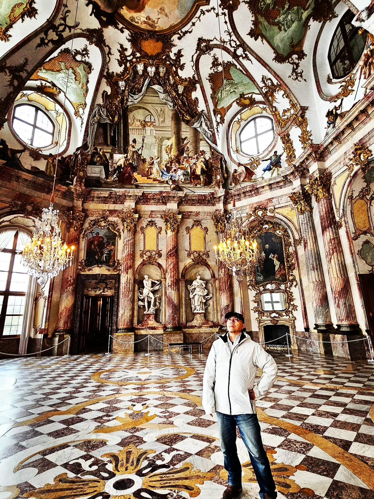
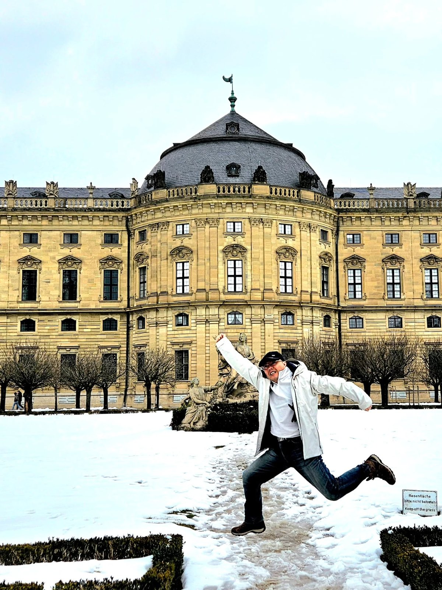
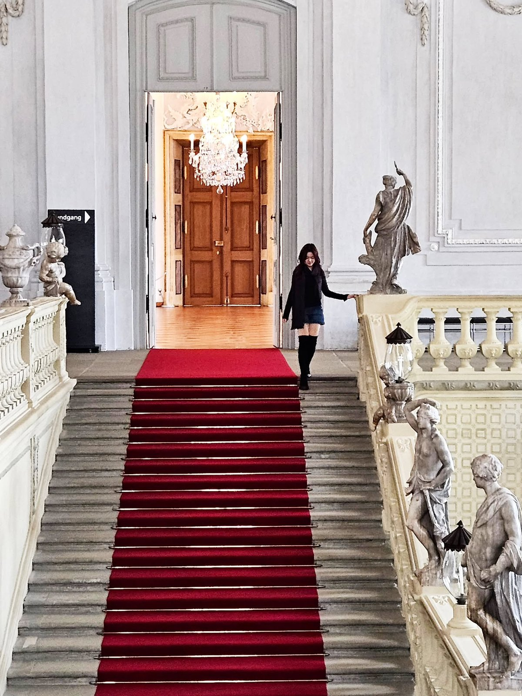
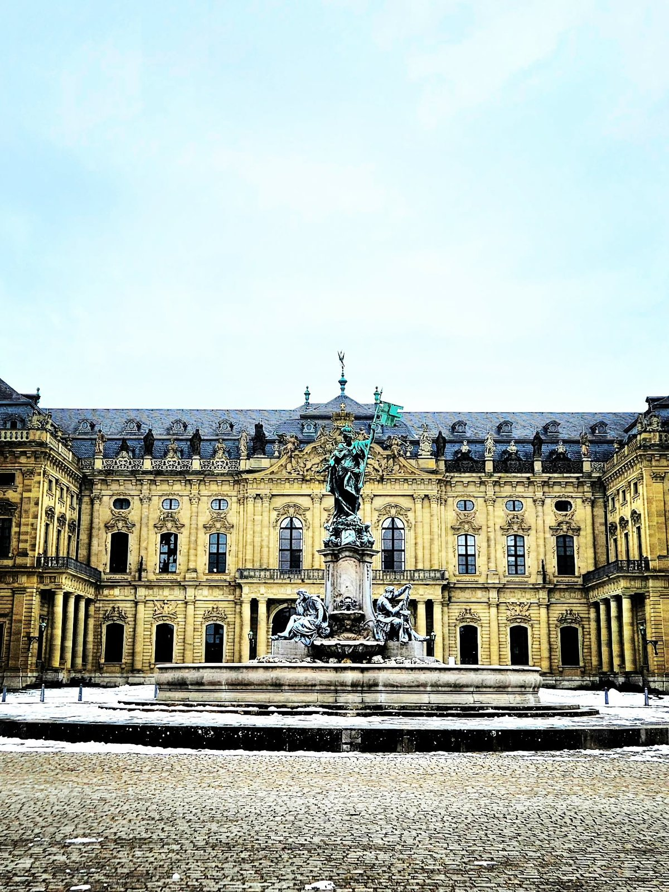
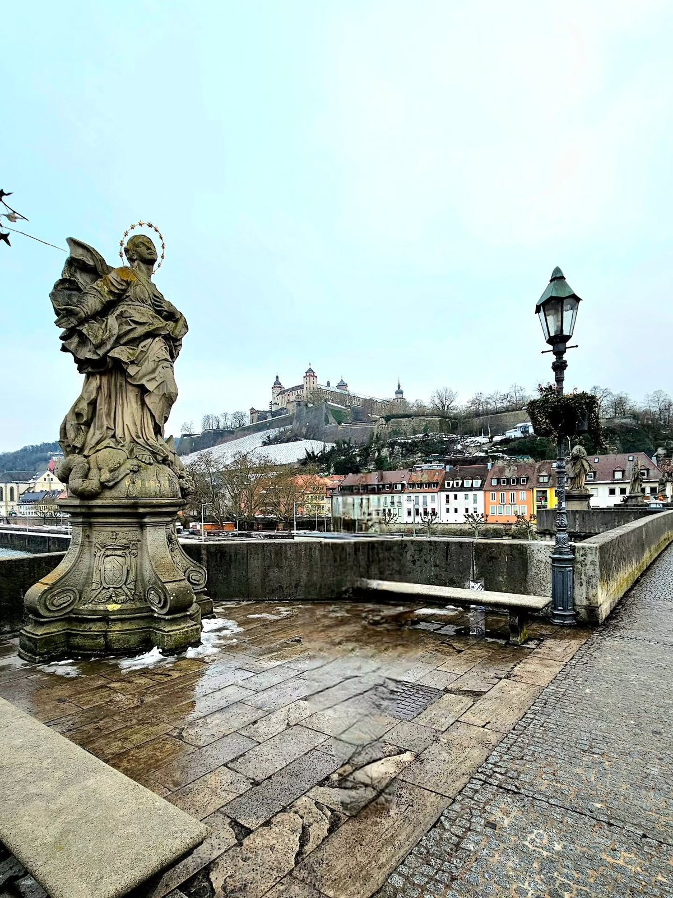
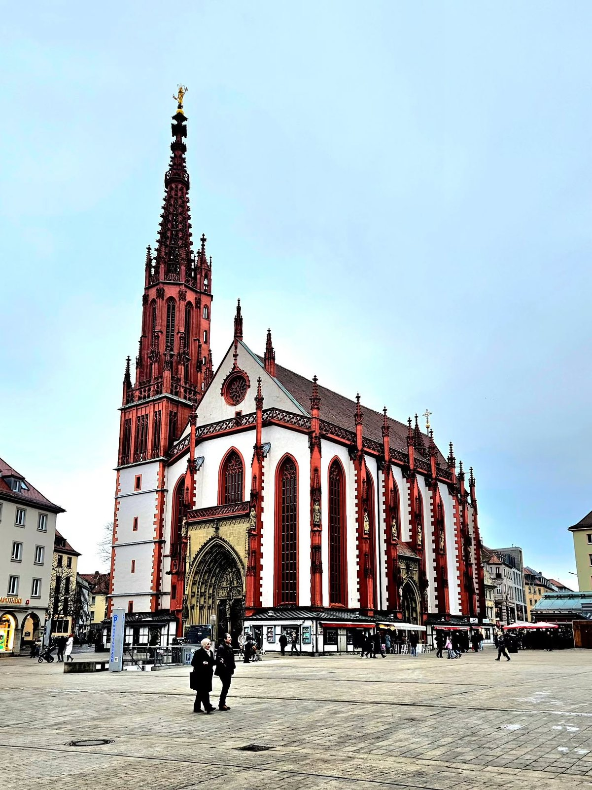
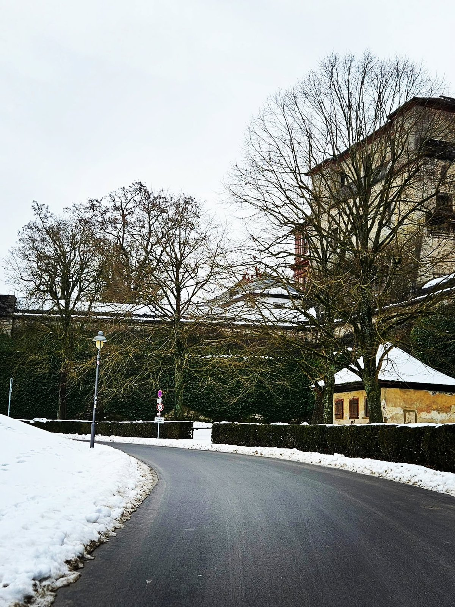
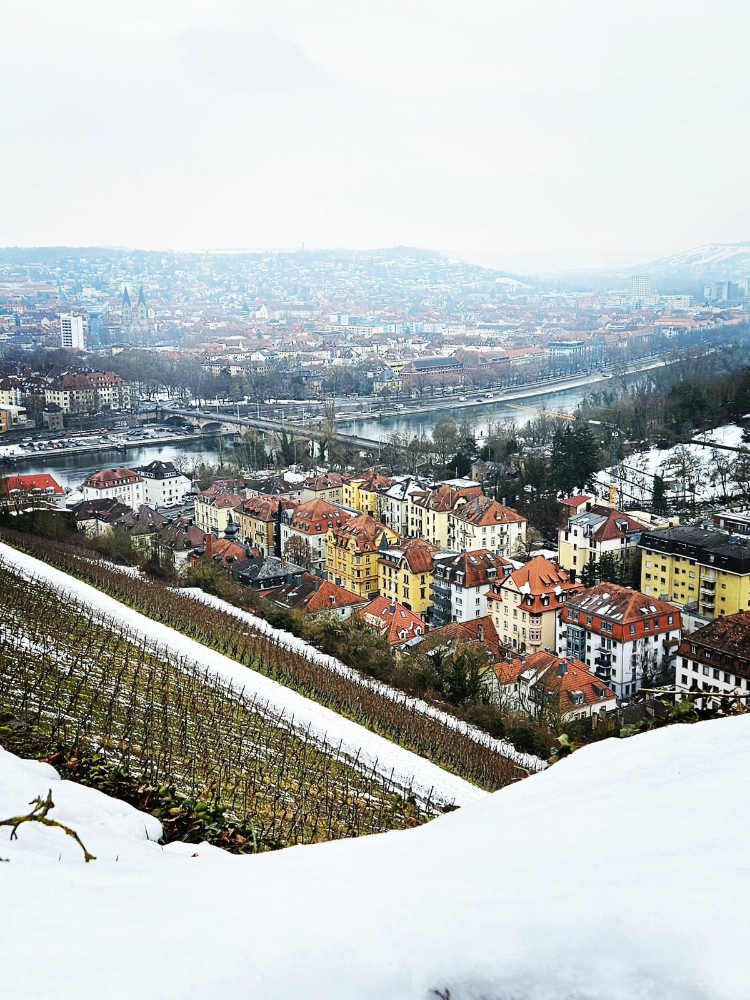

---

## ✍️ 旅人深度散文：穿梭於巴洛克天穹與美茵河畔的冬日慢時光

### 一、站在提埃坡羅的穹頂下：巴洛克極致與無閃光燈的沉浸
在冬季的週日早晨，大部分德國城鎮都陷入寧靜的休眠，而符茲堡主教宮（Würzburger Residenz）卻準時推開了巴洛克風格的厚重大門。走進被列入 UNESCO 世界遺產的階梯廳（Treppenhaus），仰頭的瞬間整個人幾乎被定在原地——義大利威尼斯畫派巨匠提埃坡羅（Giovanni Battista Tiepolo）所繪製的世界最大單幅天頂濕壁畫《四大洲》，如同一片神話天穹浩瀚鋪展，將歐、亞、非、美四洲的奇幻寓言與諸神交織於巨大的無柱拱頂之上。

一開始看到其他各國遊客在導覽人員面前大方舉起相機，我還略帶遲疑，以為大家膽子也太大。後來上前詢問才知道，這裡其實並非全面禁止攝影，而是嚴格要求「全面關閉閃光燈」。少了突兀耀眼的閃光干擾，整個廳堂維持著柔和靜謐的自然光，讓人更能靜心凝視那些歷經數百年風霜依舊鮮活的筆觸與金箔雕飾。畢竟真正讓人心生敬畏的，從來不只是相機裡的像素，而是親身佇立於穹頂之下的當下。

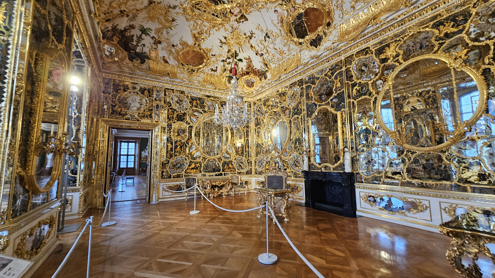
.jpg)

### 二、老美茵橋上的微醺時光：手握白酒遙望瑪麗恩堡
離開主教宮後，信步走過市集廣場與紅白色調的聖母禮拜堂（Marienkapelle），來到橫跨美茵河的舊美茵橋（Alte Mainbrücke）。這座建於 15 世紀的石橋，兩側矗立著 12 尊歷代主教與守護聖人的巴洛克雕像，氣質頗有布拉格查理大橋的影子。然而這裡多了一份法蘭肯產區獨有的風雅——橋頭的老磨坊餐廳（Alte Mainmühle）外賣窗口前，總是聚集著端著高腳杯的人群。

在寒風中點一杯當季的法蘭肯白葡萄酒（Silvaner）或冒著熱氣的熱紅酒（Glühwein），倚著斑駁的石欄杆舉杯，對岸山丘上的瑪麗恩堡要塞（Festung Marienberg）與山坡上一列列覆蓋著薄雪的葡萄藤盡收眼底。在冬日的冷冽空氣中，微醺的暖意自指尖蔓延開來，這正是符茲堡最迷人的生活節奏。

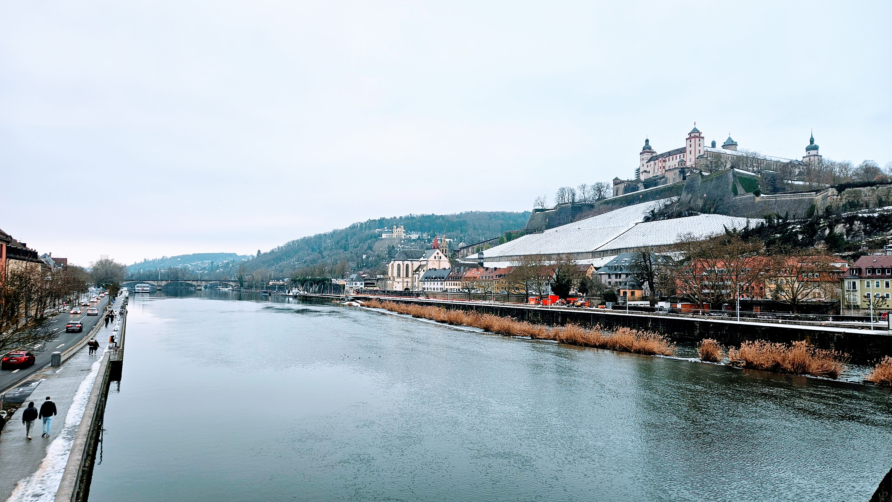
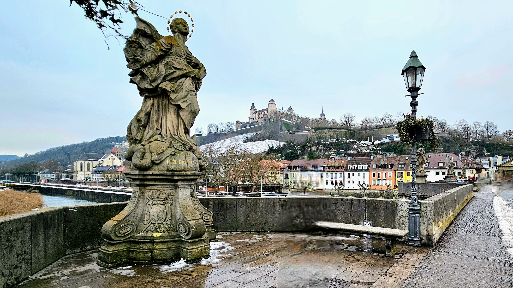
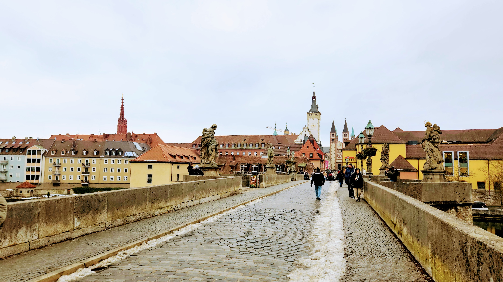

### 三、自駕直通要塞之巔：俯瞰冬日紅瓦天際線
若是盛夏，徒步穿越葡萄園登上海拔兩百多公尺的要塞無疑是一大樂事；但在積雪未融的隆冬，結冰的斜坡路段暗藏黑冰危機。這正是自駕最大的優勢——我們直接駕車順著蜿蜒的盤山道路攀升，穿過厚實的中世紀堡壘城門，直達山頂的停車場。

站在要塞石牆前的觀景平台，視野豁然開朗。腳下是整齊如織的冬眠葡萄園，美茵河宛如一條優雅的銀藍色絲帶穿過市區，老橋、主教宮、聖基利安大教堂的雙塔與錯落有致的紅瓦屋頂在冷冽的天空下顯得格外寧靜大器。

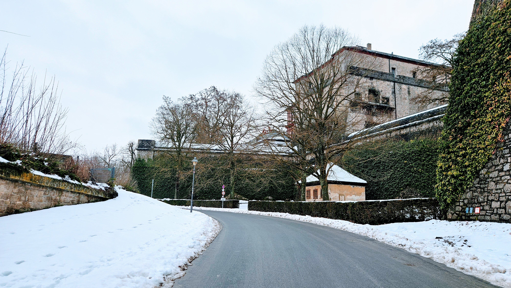
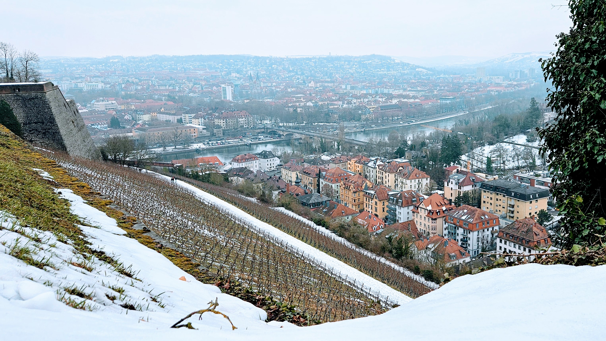

### 四、中國餐館 Gnade 的暖胃救贖，一路向南開進海德堡
連日來的豬腳、香腸與麵包，讓亞洲胃在第 7 天發出了強烈抗議。中午我們依循情報來到火車站附近的 China Restaurant Gnade。這家外表質樸的中餐館端出的川味小炒肉、口水雞與熱騰騰的酸辣湯，辛香麻辣瞬間驅散了冬日的寒氣，撫慰了疲憊的味蕾。

飽餐一頓後，我們告別這座充滿巴洛克藝術與白葡萄酒香的法蘭肯古城，開上 A81 接 A6 高速公路。午後陽光灑在無限速路段上，130 公里的路程不到一個半小時便順利抵達此行的第四個住宿基地——詩人歌德遺落了心的浪漫之都「海德堡（Heidelberg）」。

---

## 🧭 讀者抄作業：實用攻略 Bento 資訊盒 (Travel OS)

| 項目 | 實用情報 | 備註與避坑 (TripNG) |
| :--- | :--- | :--- |
| 🚗 **自駕路況** | 符茲堡 ➔ A81 ➔ A6 ➔ 海德堡 (130 km, 1.5 hr) | 瑪麗恩堡要塞建議直接開車上山頂停車場避開結冰步道 |
| 📍 **必訪景點** | 符茲堡主教宮 (€9)、舊美茵橋、瑪麗恩堡要塞 | 主教宮週日開放，室內全面禁止使用閃光燈 |
| 🍷 **美食品飲** | 法蘭肯白酒 (Silvaner)、烤豬肩肉 (Schäufele)、熱紅酒 | 老美茵橋 Alte Mainmühle 外賣窗口買酒邊走邊喝 |
| 🍜 **中餐救星** | China Restaurant Gnade (川味小炒肉、酸辣湯) | 僅收現金 (Cash Only)，建議備妥 €30–40 現金 |
| ⚠️ **週日營業** | 德國週日商店依法全日休館 | 超市與百貨皆休息，採買需提前或至中央火車站 |
| 🏨 **當晚下榻** | 海德堡基地（連住 3 晚） | 老城區為徒步區，建議停放外圍 P+R 或飯店車庫 |
